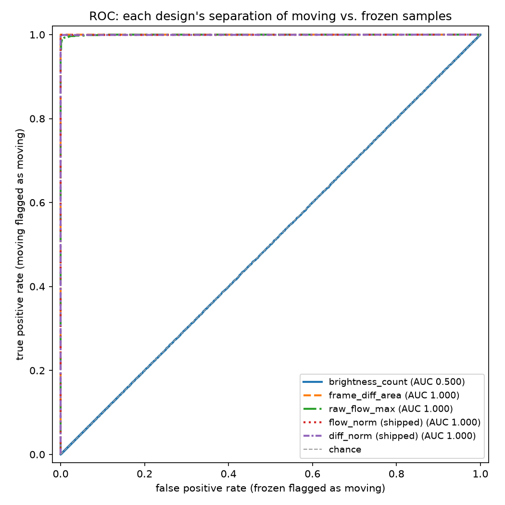
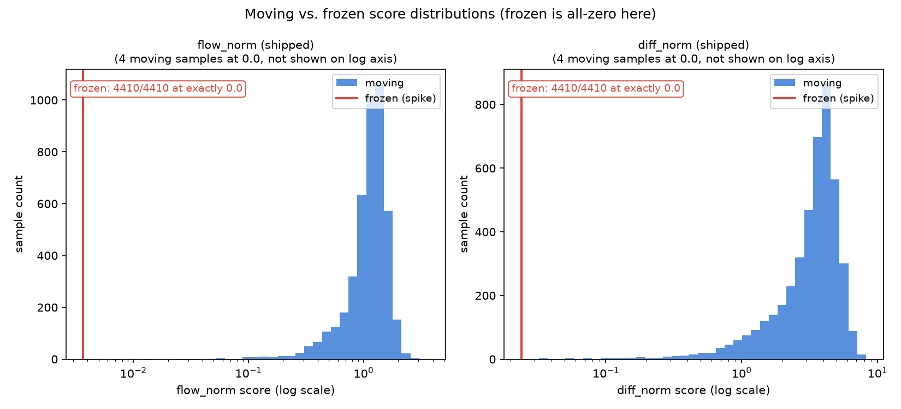
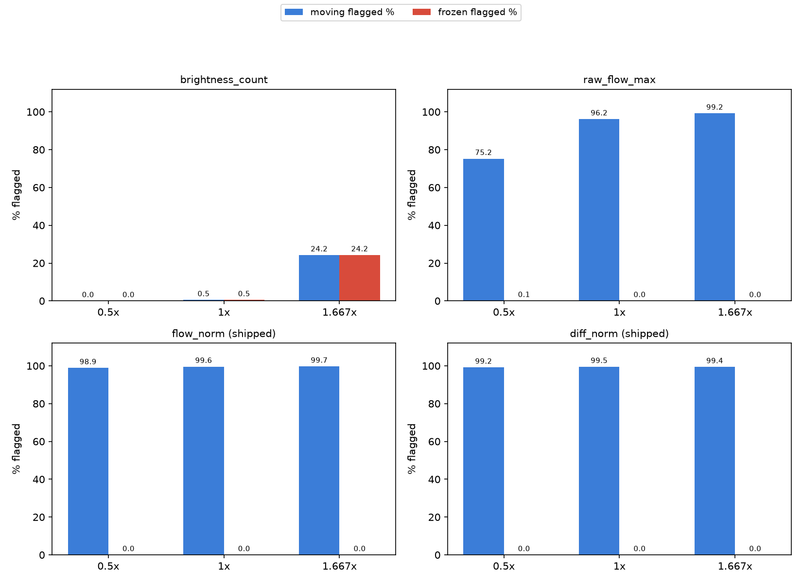
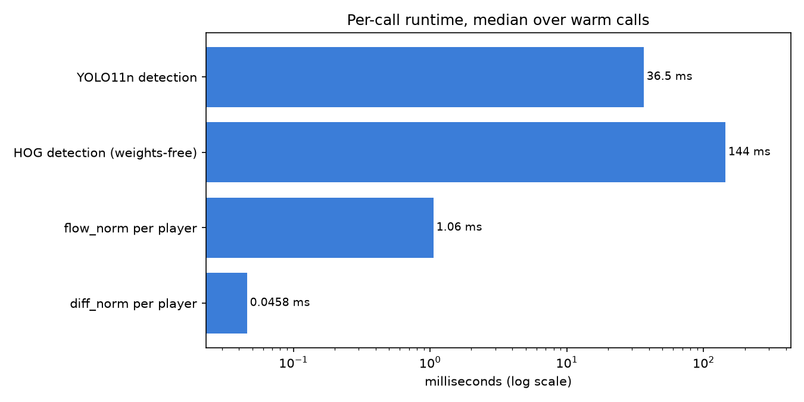
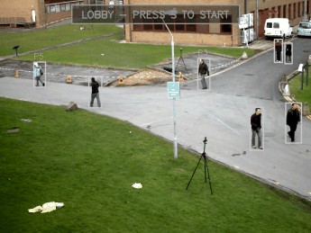

# Red Light, Green Light — a computer-vision referee

Stand in front of a camera and hold still. A referee finds everyone in
frame, tracks them, measures how much of each body changes every tenth of a
second, and calls out anyone who moves while the light is red. It plays in a
browser tab on your own machine, and the same rules run as a Python engine
over a webcam or any video file.

**[Play it in your browser](https://safdar-hussain1.github.io/red-light-green-light-cv/)** —
no install, no upload, nothing recorded.


*Red light on the ground-truth footage. Every tracked player is boxed;
crossed boxes labelled OUT are players who already moved.*

---

## What is here

- **A browser arena that plays.** Pose detection, tracking, the judge and
  the game rules all run in the tab. Every frame stays on your device:
  nothing is uploaded, nothing is recorded, nothing survives the tab
  closing.
- **A Python engine and CLI.** `redlight play` referees a webcam or a video
  file with YOLO11n or weights-free HOG detection, draws a HUD, and reports
  how the match ended.
- **A judge that was measured, not guessed.** Movement is scored in
  body-fractions per second on a fixed 0.1 s sampling clock, so a player at
  the back of the room and a player at the front are judged the same, and a
  laptop at 60 fps and a phone at 24 return the same verdicts.
- **The naive designs, built and benchmarked.** Three referees anyone would
  reach for first are implemented properly and scored on the same samples —
  including where they win.
- **Browser/Python parity, bit for bit.** The scoring kernel in the tab and
  the one in Python produce identical numbers on shared golden 96 × 96
  window fixtures. Exact equality, not a tolerance.
- **236 tests** (234 without the two slow ones), and six load-bearing claims
  checked by mutating the mechanism behind each one: **6 of 6 mutations were
  caught** by tests that already existed.

---

## Quickstart

```bash
git clone https://github.com/safdar-hussain1/red-light-green-light-cv.git
cd red-light-green-light-cv

python3 -m venv .venv
source .venv/bin/activate          # Windows: .venv\Scripts\activate
pip install -e ".[audio,analysis,dev]"

pytest
```

The YOLO11n weights are committed at `models/yolo11n.pt`, so there is
nothing to download. (`python scripts/fetch_weights.py` re-fetches them if
you ever remove the file.)

Play against your webcam:

```bash
redlight play --source 0
```

Referee the ground-truth footage instead, deterministically — this is the
demo match the benchmark publishes, and it prints
`victory - 9 player(s), 2 survived, 7 eliminated`:

```bash
redlight play --source data/vtest.avi --headless --mute \
  --seed 3 --skip 200 --auto-start 20 --max-seconds 40 \
  --countdown 1 --duration 12 --phase-min 1.5 --phase-max 3 --grace 0.6 \
  --metric flow --detector yolo --conf 0.35 --confirm-frames 3
```

Reproduce every number in this README (~2 minutes; `--fast` runs the same
harness on a 60-frame subset in about 15 seconds):

```bash
redlight benchmark --out reports/benchmark_results.json
```

Regenerate the playable page and the chant:

```bash
redlight build-site --out docs/index.html
redlight make-audio --out assets/doll_song.wav
```

---

## How the judge works

**Movement is measured in body-fractions per second.** A player two metres
from the camera moves more pixels per step than the same player ten metres
away, and a 4K sensor sees more of them than a 480p one. So every player's
box is cropped out of the grayscale frame and resampled to a fixed 96 × 96
window before anything is scored. Distance and resolution divide out, and
the score becomes the fraction of *that player* that changed, per second.

Two metrics run on those windows:

- `flow_score` — dense Farneback flow across the window; the 95th percentile
  of the displacement magnitudes, minus a 0.5 px noise floor, divided by the
  window size and by the elapsed time.
- `diff_score` — the fraction of the window whose brightness moved by more
  than 25 levels, divided by the elapsed time. Plain integer arithmetic, no
  blur, no floats in the threshold, which is what makes bit-exact agreement
  with the browser a reasonable thing to demand.

**Frame rate is handled by a clock, not by arithmetic.** Displacement really
is proportional to the gap between frames, so dividing flow by `dt` genuinely
turns it into a rate — within a design-time operating band of roughly 2.2 to
7 pixels of window displacement, documented on `flow_score` in `judge.py`.
Below that band the fixed sub-pixel deadband takes a disproportionate bite out
of the smaller step; above it the flow estimator saturates and over-reads. The
band's edges are a design-time choice rather than a swept measurement; the
tests exercise interior points of it (2.4 to 6.0 px of window displacement).

A changed-pixel count is different: it grows *faster* than linearly with
displacement, because a bigger step does not merely move more pixels, it
pushes more of them past the change threshold. Dividing by `dt` does not
rescue it. On the synthetic scene the tests use, doubling both the step and
the interval leaves the same real velocity scoring about 72% higher — so the
diff metric is made fair a different way: `FrameSampler` releases a pair only
once 0.1 s of real time has passed, and the interval is simply held fixed.
Fast cameras get more frames, not different verdicts.

**Two guards sit in front of every call.** Scores flicker — a flow estimate
spikes on a lighting change, a detection box wobbles. So each player's score
goes through an exponential moving average weighting the newest sample 0.5,
and the smoothed score has to stay above the cutoff for 3 consecutive
samples before anyone is called out. One sample back at or below the cutoff
resets the streak. On top of that the game gives a 0.6 s grace window after
the light turns red, because a player mid-stride cannot stop in zero time.
The judge and the sampler are both reset on every phase change, so no
baseline survives from one light into the next.

**The cutoffs were measured.** On the benchmark's 4410 paired samples, the
frozen class's 99th percentile is 0.0 on both metrics and the moving class's
1st percentile is 0.1534 (flow) and 0.2910 (diff). The shipped cutoff is the
midpoint of those two edges — the point furthest from both classes:
**0.0767** for flow, **0.1455** for diff. Applied to the samples they were
derived from, they flag 0.00% of frozen samples and 99.59% (flow) / 99.52%
(diff) of moving ones.

---

## Results

Everything below comes from `reports/benchmark_results.json`, produced by
`redlight benchmark` on `data/vtest.avi` — 795 frames of pedestrians
crossing a courtyard at 10 fps, YOLO11n detection at conf 0.35, seed 1729.
The sampler released 794 pairs. Every walker the tracker held becomes a
*moving* sample (4410 of them); each is paired with a *frozen* twin — the
same frame held in place with seeded gaussian sensor grain, sigma 2, on top
(4410). Reruns are byte-identical apart from the timings.

### Five designs, same samples



| Design | Scope | AUC | Cutoff used | Frozen flagged | Moving flagged |
|---|---|---|---|---|---|
| `brightness_count` | per box | 0.4998 | 7000 px | 0.50% | 0.50% |
| `frame_diff_area` | **whole frame** | 1.0000 | 7000 px | 0.00% | 35.31% |
| `raw_flow_max` | per box | 0.9996 | 2.0 px | 0.05% | 96.15% |
| `flow_score` | per box | 0.9995 | **0.0767** | **0.00%** | **99.59%** |
| `diff_score` | per box | 0.9995 | **0.1455** | **0.00%** | **99.52%** |

Read that table with three things in mind. `brightness_count` sits at chance
because it never compares two frames — its frozen and moving rates are
identical to three decimals, which is the clearest possible statement that
it has no temporal term. `frame_diff_area` takes no box at all, so every
player in a pair gets the same number; its row is a statement about the
footage, not about a player, and its failure shows up in the background
scenario below. And the "cutoff used" column is not decoration: each naive
design is judged at the round number somebody reaching for it would reach
for first, while the last two rows are judged at the cutoffs the engine
actually ships — the benchmark-selected 0.0767 and 0.1455 — so those two rows
are what the shipped referee does to these samples, not what some other
setting would have done.



Both normalized metrics score exactly 0.000 on all 4410 frozen samples
(frozen max = 0.0).

### The same players, three apparent sizes



Moving flagged / frozen flagged, at fixed cutoffs, over the 4368 samples
scoreable at all three scales:

| Design | 0.5x | 1x | 1.667x |
|---|---|---|---|
| `brightness_count` | 0.00% / 0.00% | 0.50% / 0.50% | 24.22% / 24.24% |
| `raw_flow_max` | 75.23% / 0.09% | 96.15% / 0.05% | 99.20% / 0.02% |
| `flow_score` | 98.88% / 0.00% | 99.59% / 0.00% | 99.68% / 0.00% |
| `diff_score` | 99.15% / 0.00% | 99.52% / 0.00% | 99.40% / 0.00% |

`raw_flow_max` misses 21 points of walkers at half size that it catches at
native resolution: the same stride, fewer raw pixels, below the cutoff.
Both normalized metrics hold within about a point across a 3.3x span of
apparent size — 11x in pixel area — and never flag a held frame at any scale.

### Frame rate changes nothing

The same footage delivered on a 10 fps clock and on a 30 fps clock (each
frame offered three times), compared over the content pairs both arms
released:

| Metric | Pairs compared | dt mismatch | Decisions compared | Decisions agree |
|---|---|---|---|---|
| `flow_score` | 794 | 0.00% | 4410 | **100.00%** |
| `diff_score` | 794 | 0.00% | 4410 | **100.00%** |

That is the payoff for the fixed sampling clock. Both arms release all 794
pairs at an identical 0.1 s, and every one of 4410 decisions agrees.

### A still player in a busy scene

One player crop (82 × 204) is frozen at a fixed box and composited into 230
frames of live courtyard traffic, with fresh sensor grain every frame. Two
variants:

| | Traffic passes by | Traffic walks through |
|---|---|---|
| Frames where a walker crossed the box | 40 | 177 |
| Whole-frame `frame_diff_area` flags the still player | **51.09%** of samples, first at **0.8 s** | 69.43%, first at 0.5 s |
| Per-box `flow_score` / `diff_score` | **0.00% / 0.00%** | 69.87% / 73.80% |
| Per-box, counting only crossing samples | **0.00% / 0.00%** | **89.77% / 94.89%** |

The left column is the headline: whole-frame differencing charges a
motionless player for everybody else in the shot, crossing its cutoff within
a second and staying there for half the run, while the same player scored
inside their own box reads exactly zero.

The right column is the limitation, published rather than buried. Scoring a
box means scoring whatever is inside it, and a body walking **through** your
box puts moving pixels inside it: 89.77% of the crossing samples flag a
motionless player on flow, and 94.89% on diff. See
[Limitations](#limitations) for the two caveats that make those a ceiling
rather than precise figures.

### Runtime



Median per call, Apple Silicon, single-threaded, 768 × 576 frames:

| Stage | ms |
|---|---|
| YOLO11n detection, per frame | 32.7 |
| HOG detection, per frame | 114.9 |
| `flow_score`, per player | 0.85 |
| `diff_score`, per player | 0.036 |

HOG is the **weights-free classical option** — no model file to fetch — and
on this footage at these settings it is about 3.5x *slower* than YOLO11n, not
faster. Judging costs almost nothing next to finding people, which is why
the browser can afford the diff metric on four players at 10 samples a
second.

### The demo match



One seeded run of the same `redlight play` pipeline, starting 200 frames in
so the courtyard is busy: 9 players registered, 1 lost from the arena at
0.8 s, 5 eliminated for moving at 2.7 s and 1 more at 3.3 s, 2 survivors,
outcome **victory**. The starting offset and the seed were the only things
chosen; the clustering is real, because a dozen people walking across a
courtyard are all moving when the light turns.

---

## Limitations

Every one of these is measured or reproducible, not hypothetical.

- **Somebody crossing your box can put you out.** The per-box judge protects
  a still player from traffic elsewhere in the shot (0.00%), but not from a
  body passing in front of them: 89.77% of crossing samples flag a
  motionless player on flow, and 94.89% on diff. Two caveats make those a
  ceiling rather than exact figures — the occluder is the walker's bounding
  box rather than a silhouette, so it drags some background motion across
  with it, and the measurement is raw per-sample scoring without the
  smoothing and 3-in-a-row confirmation a brief pass-through may never
  clear. The direction is not in doubt, only the magnitude.
- **Flow saturates on fast motion.** `flow_score`'s operating band is
  roughly 2.2 to 7 pixels of window displacement — a design-time band
  documented on the function, not a swept measurement; the tests exercise
  interior points of it (2.4 to 6.0 px). Beyond it Farneback over-reads, so
  a fast step scores higher than its true displacement. Over-reading errs
  toward calling movement, which is the safe direction for a referee, but it
  means the number stops being a literal body-fraction at the fast end.
- **The frozen class is held frames plus sigma-2 grain.** Sigma 2 sits an
  order of magnitude below the diff metric's 25-level change threshold, so
  `diff_score` reading exactly 0.0 on frozen samples is *structural, not
  evidence*. The frozen result worth trusting is flow's, whose deadband is
  sub-pixel and was not chosen against this noise level.
- **The moving class is people walking continuously.** Its 1st percentile is
  not the faintest motion a real player can make — someone shifting their
  weight scores far below anyone in this footage. The measured cutoffs
  therefore err strict, and they were taken on stable crops rather than on
  anyone standing in a living room. The browser treats the measured number
  as its strictest setting for that reason: ruthless is 1.0x, standard —
  the default — is 2.0x, forgiving is 4.0x, and the countdown lifts the
  cutoff further if the player's own camera turns out to be noisier than
  the footage was.
- **A wobbling box used to be scored as a moving player.** Pose landmarks
  shift a couple of pixels every frame even on somebody holding perfectly
  still, and a crop window cut from that box shifts with it. The browser now
  smooths each player's scoring rectangle and pins it in place through the
  countdown and every red light, so a still player's window does not move.
  `docs/DESIGN.md` § 7 has the mechanism and the numbers.
- **Identity in the browser is overlap matching, not re-identification.**
  Two players who swap places while crossing will swap ids, and the referee
  would then judge them as each other. In a game where everyone is standing
  still that situation does not arise, but it is a real bound on the
  tracker.
- **The pose runtime is loaded without a subresource-integrity hash.** It is
  the one documented exception on the page: MediaPipe's loader resolves its
  own wasm binary and model URLs at run time, so there is no fixed set of
  bytes to hash. It is pinned to an exact version, fetched only after you
  press play and grant a camera, and nothing else on the page depends on it
  — every published number, the referee lab, the replay and the selftest run
  with it never loading.
- **The benchmark is one scene.** `data/vtest.avi` is a single outdoor
  courtyard at 10 fps. Every number above describes the judge on that
  footage. Nothing here has been measured across lighting conditions,
  indoor scenes, or phone cameras.

---

## Privacy and ethics

Every frame is processed on the device it was captured on. The browser
arena opens the camera in the tab, runs pose detection, scoring and the game
rules locally, and never sends a frame anywhere — nothing is uploaded,
nothing is recorded, and nothing is kept after the tab closes. The Python
engine writes video only when you explicitly pass `--record`.

This is a referee for a party game. It measures how much of a bounding box
changed between two frames; it does not identify anybody, does not store
anything about anybody, and is not a surveillance tool. Please do not point
it at people who have not chosen to play.

---

## Repository structure

```
src/redlight/       the engine: detection, tracking, judge, game, HUD, CLI,
                    audio, the benchmark harness, and the site build
site/               the browser arena: judge, game, pose, arena, lab, charts,
                    chant, doll, styles, page template
docs/index.html     the built page, served by GitHub Pages
docs/DESIGN.md      the design card: pipeline contracts, judge math,
                    threshold selection, claims and their guarding tests
notebooks/          judge_design.ipynb — how the judge was arrived at
reports/            benchmark_results.json and the committed figures
scripts/            figure rendering, weight fetching, site verification
tests/              236 tests, including browser/Python parity and framing
data/, models/      ground-truth footage and the YOLO11n weights
```

## Built with

Python 3.10+, NumPy, OpenCV, Ultralytics YOLO11n, scikit-learn and
matplotlib for the benchmark and figures, pygame for optional sound. The
browser side is plain JavaScript with no build step — MediaPipe Tasks Vision
for pose and Chart.js for the result charts, both pinned. Tests are pytest,
with Node driving the parity suite.

## Licence

This code is MIT licensed — see [LICENSE](LICENSE).

Two things in the repository carry other terms:

- `data/vtest.avi` is an OpenCV sample video, BSD licensed.
- `models/yolo11n.pt` is an Ultralytics YOLO11 model. Ultralytics is an
  AGPL-3.0 runtime dependency; if you redistribute or host something built
  on those weights, read their licence and comply with it.

## Read more

- **[docs/DESIGN.md](docs/DESIGN.md)** — the design card: every pipeline
  stage's contract, the judge's formulas, how the thresholds were chosen,
  the invariance evidence, the six claims and the tests that guard them.
- **[notebooks/judge_design.ipynb](notebooks/judge_design.ipynb)** —
  designing a motion judge you cannot fool, walked through against the
  measured results.
</content>
